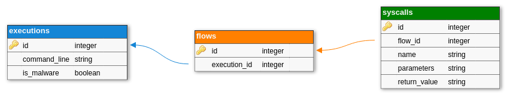

# OctAV Syscall Dataset Generator

This repository's goal is to generate a dataset of binaries execution for machine learning purposes.

This dataset generator is able to retrieve the execution flow of binaries in a safe way.
There are two modes, the first one uses firejail (very lightweight sandbox but not as secure as virtual machines) and is meant for legit binaries. The second uses the LiSa sandbox (Docker + QEMU VMs) and is meant for malwares.

The first mode is way faster, and enough security-wise to execute legit binaries.
It will for example prevent a legit `rm` binary from deleting something important.     

The second mode however is really heavy on the machine's resources, but better be safe when executing malwares...

## Requirements

You need the following programs to be installed :

- git
- docker-compose
- firejail
- strace
- xvfb

## Installation

```
$ git clone https://github.com/OctAVProject/OctAV-Dataset-Generator.git
$ cd OctAV-Dataset-Generator/
$ python3 -m venv venv
$ . venv/bin/activate
$ pip install -r requirements.txt
```

## Usage

Two modules are available : `dataset` and `sandbox`. The first one aims to build the dataset, the second one is purely sandbox managements.

```
$ python -m dataset --help
usage: python -m dataset [-h] [--malware-dirs DIRECTORY [DIRECTORY ...]]
                         [--legit-dirs DIRECTORY [DIRECTORY ...]] --db DB_FILE [--overwrite]
                         [--append] [--stats]

This is the dataset builder.

optional arguments:
  -h, --help            show this help message and exit
  --malware-dirs DIRECTORY [DIRECTORY ...]
                        directories of malwares to process
  --legit-dirs DIRECTORY [DIRECTORY ...]
                        directories of legit binaries to process
  --db DB_FILE          sqlite database
  --overwrite           delete the existing database to create a new one
  --append              append results to the existing database
  --stats               prints some stats about the given dataset
```

Ex: `python -m dataset --legit-dirs /bin /sbin /usr/bin --db dataset.db --append --stats`

```
$ python -m sandbox --help
usage: python -m sandbox [-h] [--start] [--submit FILE]

This is the sandbox manager.

optional arguments:
  -h, --help     show this help message and exit
  --start        start LiSa docker containers
  --submit FILE  submit a file to the LiSa sandbox
```

Ex: `python -m sandbox --start --submit ~/Downloads/evil_malware`

## Generated dataset

This script outputs an sqlite database with the following format :



On execution, some binaries will start multiple sub-processes in order to speed up their work.
Each of these processes is tracked individually, we called them "flows" in our database.
Each flow contains a sequence of syscalls. If syscalls have the same flow_id, it means they belong to the same process.


For machine learning purposes, you might want to use csv instead, just perform the following command :

```
$ sqlite3 -header -csv dataset.db "SELECT * FROM syscalls" > dataset.csv
```
